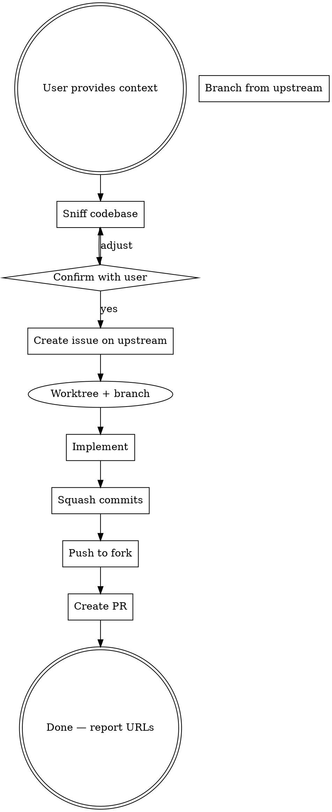

# Burst

Rapidly ship a small change through the full cycle: issue → branch → implement → squash → PR.

**Your first output MUST be:** "Using burst to rapidly implement and ship." — before any tool calls or other text.

<HARD-GATE>
You MUST have an `upstream` remote configured. Run `git remote -v` to verify. If missing, stop and tell the user to add it.
You MUST have `gh` authenticated. Run `gh auth status` to verify. If not authenticated, stop and tell the user.
Do NOT proceed past this gate without both checks passing.
</HARD-GATE>

## Pipeline



## Step 1: Sniff Codebase

Gather context quickly — spend no more than 10 seconds here.

- `git remote -v` — identify `upstream` repo (org) and `origin` (fork)
- `git ls-remote --symref upstream HEAD` — detect default branch (main or master)
- Quick file/directory scan to identify files relevant to the task
- Classify task as `fix` or `feat`
- Determine conventional commit scope (component or package name)
- `gh label list -R <upstream-repo> --search frontend` — check if `frontend` label exists

## Step 2: Confirm Plan

Present exactly this block and wait for user approval:

```
Burst: Here's what I'll do
- Type: fix/feat
- Scope: <component/package>
- Issue title: <title>
- Files likely touched: <list>

Proceed?
```

This is the ONLY user gate. If user says no, adjust and re-confirm. Once approved, run the remaining steps without interruption.

## Step 3: Create Issue on Upstream

Use `gh issue create -R <upstream-repo>`.

For bugs:

```
## Bug
<description>

## Root Cause
<what's wrong>

## Proposed Fix
<what will change>
```

For features:

```
## Problem
<what's missing>

## Proposed Solution
<what will be built>
```

Flags:
- `--assignee @me`
- `--label frontend` (only if label exists from step 1; omit silently if not)

Capture the issue number and node ID from output.

After creating the issue, set the issue type to **Task** and add it to the **Backlog** project using GraphQL:

```bash
# Get the issue node ID
ISSUE_ID=$(gh api graphql -f query='{ repository(owner: "<org>", name: "<repo>") { issue(number: <N>) { id } } }' --jq '.data.repository.issue.id')

# Set issue type to Task (find type ID via repository.issueTypes query)
gh api graphql -f query='mutation { updateIssueIssueType(input: { issueId: "'"$ISSUE_ID"'", issueTypeId: "<task-type-id>" }) { issue { id } } }'

# Add to Backlog project (find project ID via organization.projectsV2 query)
gh api graphql -f query='mutation { addProjectV2ItemById(input: { projectId: "<backlog-project-id>", contentId: "'"$ISSUE_ID"'" }) { item { id } } }'
```

Look up the issue type ID and project ID in step 1 (sniff codebase) and cache them for the session.

## Step 4: Worktree + Branch

Invoke the `superpowers:using-git-worktrees` skill to create an isolated workspace so your current branch stays untouched. The branch name MUST be `issue-<N>` where N is the issue number. No other naming convention.

The skill prefers a native worktree tool and falls back to `git worktree add`. Burst needs the branch based on the upstream default branch, so once inside the new worktree, set the base explicitly before implementing:

```bash
git fetch upstream
git checkout -B issue-<N> upstream/<default-branch>
```

Work inside this worktree for the remainder of the pipeline.

## Step 5: Implement

Code the change directly. No sub-skill invocation. No brainstorming, planning, or TDD. Just implement using codebase context from step 1.

Do NOT write tests unless the user's context explicitly mentions tests. Burst is about shipping the change the user described — nothing more.

## Step 6: Squash Commits

```bash
git reset --soft upstream/<default-branch>
git add -A
git commit -m "<type>(<scope>): <description>

Closes #<N>"
```

Use `git reset --soft` — NOT `git rebase -i` (interactive rebase is unsupported). Commit title uses conventional commits: `fix(scope): ...` or `feat(scope): ...`

## Step 7: Push to Fork

```bash
git push -u origin issue-<N>
```

If branch already exists on remote:

```bash
git push --force-with-lease origin issue-<N>
```

## Step 8: Create PR on Upstream

```bash
gh pr create -R <upstream-repo> --title "<type>(<scope>): <description>" --body "$(cat <<'EOF'
## Summary
- <bullet points describing changes>

## Test plan
- [ ] <specific test steps>

Closes #<N>

Generated with [Claude Code](https://claude.com/claude-code)
EOF
)"
```

Add `--label frontend` only if the label exists (from step 1).

Do NOT assign the PR. Do NOT use `--assignee`.

When done, report both URLs back to the user:

```
Burst complete:
- Issue: <issue URL>
- PR: <PR URL>
```

## Red Flags — STOP

| Thought | Action |
|---------|--------|
| "Let me plan this out first" | No. Burst skips planning. Implement directly. |
| "I should write tests first" | No. Burst skips TDD unless user asked for tests. |
| "Let me brainstorm approaches" | No. The user already decided. Execute. |
| "I should ask more questions" | No. You confirmed in step 2. Ship it. |
| "This might be too big for burst" | Trust the user. They chose /burst intentionally. |
| "Let me create the issue on origin" | WRONG. Issues go on upstream. Always. |
| "I'll assign the PR to @me" | WRONG. Only the issue is assigned. PR is not. |
| "I'll use git rebase -i to squash" | WRONG. Use `git reset --soft`. Interactive rebase is unsupported. |
| "I'll name the branch feat/..." | WRONG. Branch name is `issue-<N>`. Always. |
| "I should add remotes first" | WRONG. Hard-gate requires them to exist already. Stop and tell user. |
| "I'll just checkout a branch" | WRONG. Create an isolated worktree via the `superpowers:using-git-worktrees` skill. Never checkout in the main tree. |
| "I'll forget to report the URLs" | Report BOTH issue URL and PR URL at the end. Always. |
